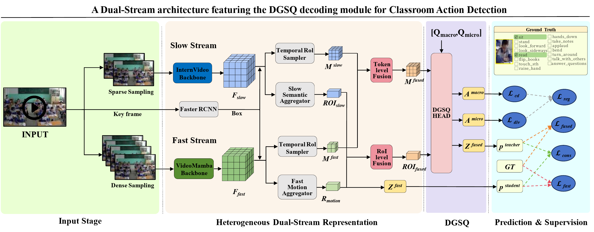

# HDSQ

Official implementation of **HDSQ: Heterogeneous Dual-Stream Representation and Dual-Granularity Synergistic Query for Fine-Grained Classroom Action Detection**.

HDSQ is a fine-grained classroom action detection framework built upon **InternVideo** and extended with:

- **Heterogeneous Dual-Stream Representation (HDSR)**
- **Dual-Granularity Synergistic Query (DGSQ)**

The framework is designed to address subtle motion differences, dense classroom targets, and strong co-occurrence bias in classroom action detection.

  

> Overall framework of HDSQ.

---

## Installation

Please find installation instructions in [install.md](install.md).

---

## Contributors